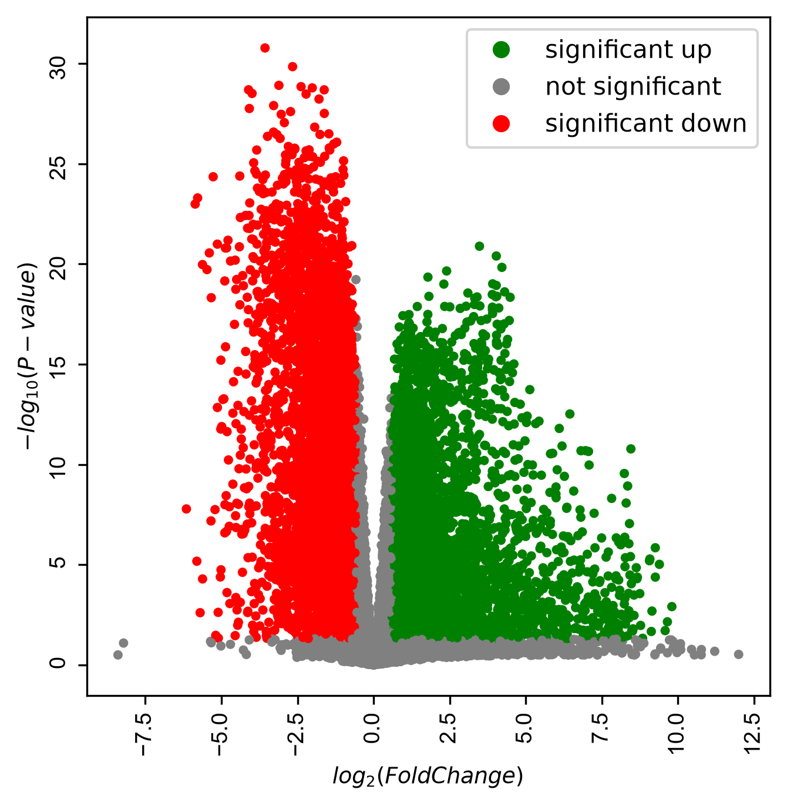
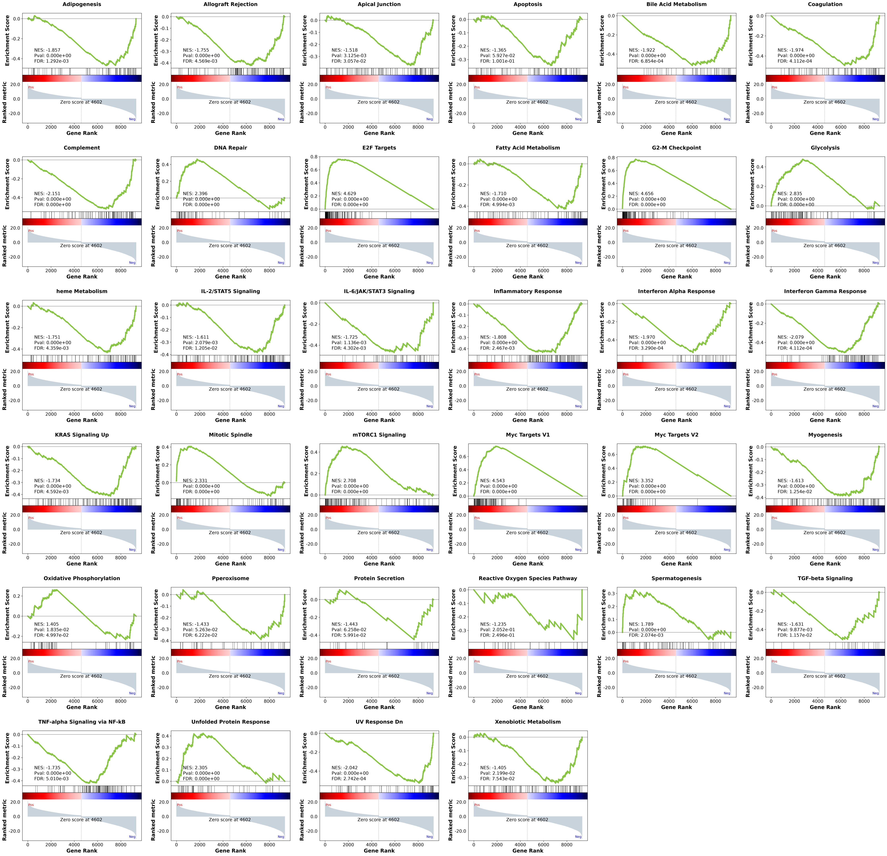

# Differentially Expressed Genes (DEGs) Analysis in Lung Squamous Cell Carcinoma (LUSC)

A data-driven bioinformatics study analyzing paired RNA-seq Gene Expression (GE) data for **Lung Squamous Cell Carcinoma (LUSC)** from TCGA. This project evaluates differential expression under paired vs. independent statistical assumptions, identifies key up- and down-regulated genes, and identifies biological pathways using Gene Set Enrichment Analysis (GSEA).

## Overview

The primary objective of this project is to perform end-to-end differential gene expression (DEG) profiling on LUSC TCGA expression datasets:

1. **Hypothesis Testing:** Evaluate the impact of study design by comparing Paired $t$-tests against Independent Two-Sample $t$-tests.
2. **Fold Change Analysis:** Compute log2 fold changes ($\log_2 \text{FC}$) to measure expression magnitude changes.
3. **Volcano Plot Identification:** Isolate biologically and statistically significant DEGs.
4. **Pathway Enrichment (GSEA):** Run Functional Enrichment Analysis using MSigDB Hallmark Gene Sets via gseapy.

## Dataset Description

The dataset consists of two tab-separated `.txt` FPKM gene expression files located in `project_main_data/:File`
|Name|Description|
|---|---|
|`lusc-rsem-fpkm-tcga-t_paired.txt`|Gene expression levels in **Tumor / Cancer** tissues|
|`lusc-rsem-fpkm-tcga_paired.txt`|Gene expression levels in **Healthy / Control** tissues|

**Dataset Note:** _Samples are paired across both files in identical patient order. Genes are identified by standard_ `Hugo_Symbol` _identifiers._

## Project Architecture

```bash
dge_lusc/
├── config/
│   ├── paths.py
│   └── settings.py
├── project_main_data/
│   ├── lusc-rsem-fpkm-tcga-t_paired.txt
│   └── lusc-rsem-fpkm-tcga_paired.txt
├── analysis/
│   ├── fold_change.py
│   ├── ht_fc_comparison.py
│   └── hypothesis_testing.py
├── utils/
│   └── utils.py
├── results/
│   ├── deg_comparison_summary.csv
│   ├── deg_independent.csv
│   ├── deg_paired.csv
│   ├── volcano_plot.png
│   └── gsea_results/
│       ├── prerank/
│       ├── gene_sets.gmt
│       ├── gseapy.gene_set.prerank.report.csv
│       ├── gseapy.prerank.2070949375216.log
│       └── prerank_data.rnk
├── main.py
├── requirements.txt
├── .gitignore
└── README.md
```

## Methodology & Workflow

1. **Hypothesis Testing**
2. **Fold Change**
3. **Hypothesis Testing vs. Fold Change**
4. **Volcano Plot**
   
5. **Gene Set Enrichment Analysis (GSEA)**
   `results/gsea_results`
   - Extracts significant paired DEGs and computes a continuous ranking metric:
     $$\text{Score} = \text{sign}(\log_2 \text{FC}) \times \left(-\log_{10}(P_{\text{paired}})\right)$$
     This metric captures both directional change and statistical confidence, passing the ranked genome to `gseapy.prerank` for pathway scoring against `MSigDB_Hallmark_2020`.



## Installation & Setup

### Prerequisites

- Python 3.9+

1. **Clone the repository**

```bash
git clone https://github.com/Mahmoud46/bioinformatics-final-project-lusc-gene-expression-analysis.git
cd bioinformatics-final-project-lusc-gene-expression-analysis
```

2. **Set up virtual environment**

```bash
# Windows
python -m venv venv
venv\Scripts\activate

# Linux / MacOS
python3 -m venv venv
source venv/bin/activate
```

3. **Install dependencies**

```bash
pip install -r requirements.txt
```

## Usage

Execute the pipeline end-to-end:

```bash
python main.py
```

---

© December 2022 Mahmoud Zakaria, All rights reserved.
